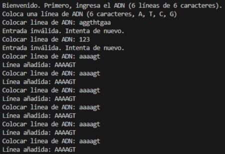
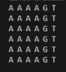
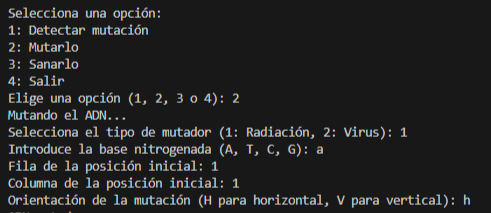
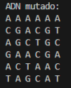
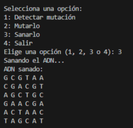
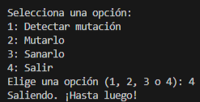

# Global Python :snake:
# 🧬 Guía de Uso: Programa de Análisis de ADN y Manipulación de ADN

Este programa permite analizar, manipular y sanar cadenas de ADN. Utiliza algoritmos para detectar mutaciones horizontales, verticales y diagonales, además de ofrecer herramientas para simular mutaciones y revertirlas.

## 📌 Introducción

1. *ejecutable.py*: Script principal que permite interactuar con el programa, ingresar una secuencia de ADN y elegir entre detectar mutaciones, generar mutaciones o sanar el ADN.
2. *clases.py*: Contiene las clases Detector, Mutador, Radiacion, Virus y Sanador, cada una con métodos específicos para la manipulación y análisis de la secuencia de ADN.

---

## 🚀 **Iniciando el Programa**

### Requisitos previos

- Python instalado (versión 3.8 o superior).
- Tener ambos archivos (**clases.py** y **ejecutable.py**) en el mismo directorio.

1. **Da click** en el botón correspondiente para correr el código de ejecutable.py en tu IDE de preferencia, o ejecuta el comando para abrir la terminal en el IDE y correr el programa.  

   O en su defecto, abre una terminal en el directorio del archivo y ejecuta el comando **python ejecutable.py**
   ```bash
   cd directorio_del_archivo
   python ejecutable.py 

2. **Ingresa la Matriz de ADN:**  
   - La matriz debe **6 líneas**, cada una con **6 caracteres**.
   - Solo puede contener los caracteres: `A`, `G`, `T` y `C`.  
   - Si introduces un formato incorrecto, el programa mostrará un mensaje de error.  
   
   **Ejemplo de entrada válida:**  
   
   

---

## 🔢 **Opciones del Menú Principal**

Al iniciar el programa, tendrás un menú interactivo con las siguientes opciones:

1️⃣ **Detectar mutantes**  
2️⃣ **Mutar el ADN**  
3️⃣ **Sanar el ADN**  
4️⃣ **Salir del programa**  

Selecciona el número correspondiente para realizar la acción deseada.


---

## 1️⃣ 🧪 **Detección de Mutantes**
- Si seleccionas la opción `1`, el programa analizará la cadena de ADN y determinará si contiene un gen mutante.  

- **Horizontal**: Secuencia de 4 caracteres idénticos en una fila.
- **Vertical**: Secuencia de 4 caracteres idénticos en una columna.
- **Diagonal**: Secuencia de 4 caracteres idénticos en diagonal (principal o secundaria).

  - Si **se detecta un gen mutante**, selecciona la opción `3` para **sanar el ADN**.  
  - Si **no se detecta un gen mutante**, selecciona la opción `2` para **mutar el ADN**.

---

## 2️⃣🔄 **Mutar el ADN**
Al seleccionar la opción `2`, puedes elegir cómo deseas mutar el ADN:  
1. **Radiación**: Presiona la tecla `1`. Lo que ejecuta es una mutación de tipo horizontal `H` o vertical `V`.  
2. **Virus**: Presiona la tecla `2`. Ejecuta una mutación de tipo diagonal `D` por defecto sobre el ADN.  



**Pasos para mutar**:

1. Selecciona el tipo de mutador (Radiación o Virus).
2. Introduce la base nitrogenada deseada (A, T, C, G).
- `A` para **Adenina**  
- `G` para **Guanina**  
- `T` para **Timina**  
- `C` para **Citosina** 
3. Especifica la posición inicial (fila y columna).
4. Indica la orientación (solo para Radiación: H o V).

El programa aplicará la mutación y mostrará la nueva matriz de ADN.


---

## 3️⃣🩺 **Sanar el ADN**
Selecciona la opción `3` para restaurar la cadena de ADN a su estado original si contiene mutaciones. 

- Esto es especialmente útil si se detectaron mutantes en la cadena.
-Se generará una nueva matriz de ADN aleatoria que **no contenga mutaciones**.
- El programa imprimirá la matriz sana en pantalla



---

## ✅ **Finalizando el Programa**
Cuando desees salir, presiona el número `4`.  
El programa finalizará y todos los cambios quedarán registrados.



---

## 🎯 **Notas Importantes**
- Asegúrate de ingresar una matriz válida para evitar errores.  
- Puedes volver a los pasos anteriores para realizar análisis adicionales antes de salir.  

¡Explora las posibilidades de este programa y transforma tus cadenas de ADN! 🚀

---
## 🎯 Notas Técnicas

### Clases y Funcionalidades Principales

- **Detector**  
  Propósito: Detectar mutaciones en la matriz de ADN.  
  Métodos clave:
  - `detectar_mutantes_horizontal`: Busca mutantes en filas.
  - `detectar_mutantes_vertical`: Busca mutantes en columnas.
  - `detectar_mutantes_diagonal`: Busca mutantes en diagonales.

- **Mutador**  
  Clase base para aplicar mutaciones. Tiene dos derivadas:
  - **Radiación**: Mutaciones horizontales y verticales.
  - **Virus**: Mutaciones diagonales.

- **Sanador**  
  Genera una nueva matriz de ADN aleatoria si se detectan mutantes.

## ✅ Recomendaciones de Uso

- Valida siempre la entrada inicial para evitar errores.
- Usa la opción **Sanar** si encuentras mutantes y necesitas restaurar el ADN.
- Experimenta con diferentes mutaciones para explorar cómo afectan al ADN.


### 🍵Integrantes del grupo
- Emiliano Orobello
- Tiago Funes 
- Haquin Sergio
- Lemos Sofía
- Barrios Pablo 